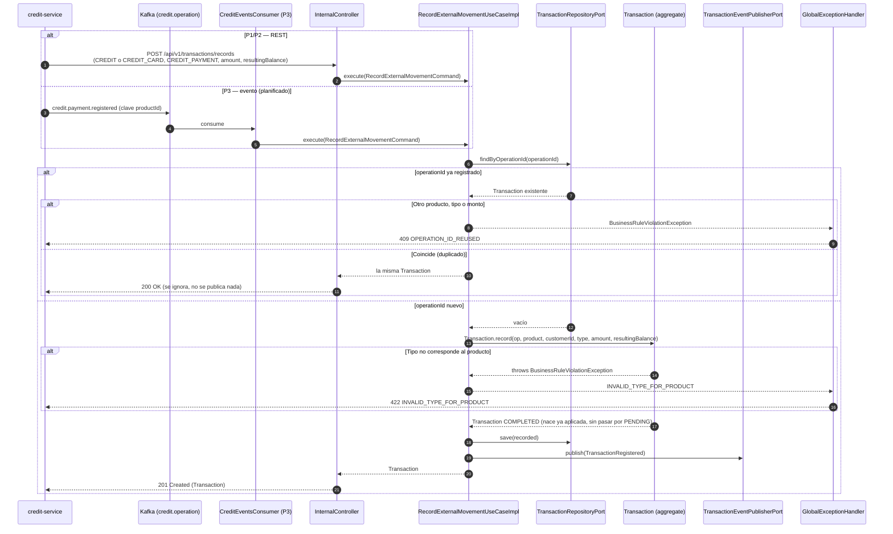

# Secuencia — Registro de un pago de crédito (`POST /transactions/records`)

`credit-service` ya aplicó el pago sobre su propio producto (crédito o tarjeta); aquí solo se
**registra** en el historial, sin validar saldos ni llamar a `account-service` (regla 12). Interno
(`x-gateway-internal: true`). Implementado en `RecordExternalMovementUseCaseImpl` (R3) +
`InternalController` / `GlobalExceptionHandler` (R5). En P3 el mismo caso de uso se dispara desde el
evento `credit.payment.registered` (tópico `credit.operation`), sin cambiarlo.

## Notas

- **Tipos válidos por producto:** `CREDIT` → `CREDIT_PAYMENT`; `CREDIT_CARD` → `CARD_PAYMENT`
  (pago de la tarjeta) o `CARD_CHARGE` (consumo). Mismo flujo para los tres; en P3 el consumo llega
  como `credit.card.charge.registered`.
- **No hay saga ni reintento:** el efecto ya ocurrió en `credit-service`. Un duplicado (mismo
  `operationId`, mismos datos) se acepta sin crear otro registro, así que `credit-service` puede
  reintentar sin riesgo.
- **`resultingBalance`** aquí es el saldo pendiente del crédito o el monto usado de la tarjeta, no
  el saldo de una cuenta.
- **Pendiente conocido:** `Transaction.record` no recibe `occurredAt` ni `payerCustomerId`, aunque
  el contrato los manda. `occurredAt` se guarda con la hora de registro en este servicio (no la del
  pago real) y el pagador tercero se pierde. Cerrarlo requiere ensanchar la factory `record(...)`
  y `RecordExternalMovementCommand`.
- **P3:** `CreditEventsConsumer` todavía no existe (`infrastructure/adapter/in/kafka/` solo tiene su
  `package-info.java`); se dibuja como referencia del diseño.
