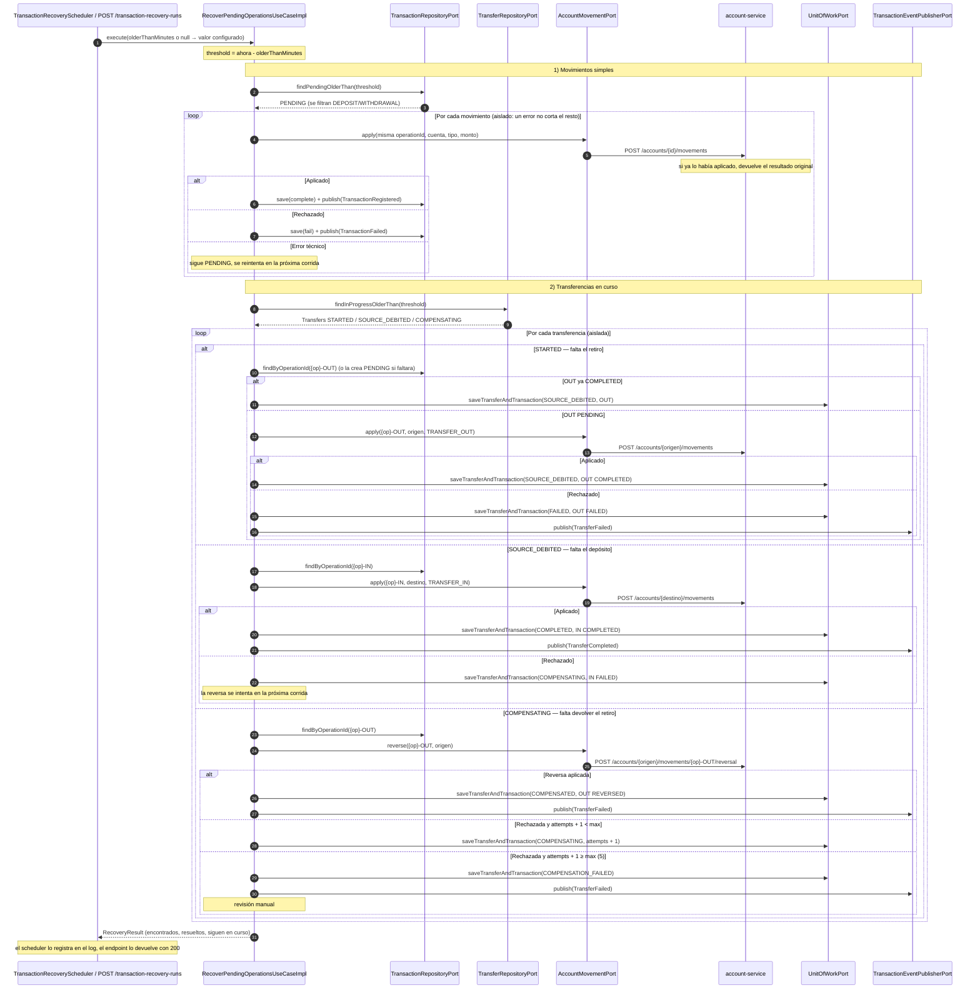

# Secuencia — Recuperación de operaciones pendientes

Retoma lo que quedó a medias por una caída o un timeout (regla 14): depósitos/retiros `PENDING` y
transferencias detenidas en `STARTED`, `SOURCE_DEBITED` o `COMPENSATING`. Implementado en
`RecoverPendingOperationsUseCaseImpl` (R3/R4). Se dispara cada minuto desde
`TransactionRecoveryScheduler` (`transaction.recovery.cron`, R6) o a mano con
`POST /transaction-recovery-runs` (`InternalController`, interno). Solo toma lo que lleva más de
`transaction.recovery.pending-minutes` (2 por defecto) sin avanzar.

## Notas

- **Por qué es seguro reintentar:** cada paso usa la misma `operationId` que el intento original, y
  `account-service` guarda cada operación en `account_operations`; una repetición devuelve el
  resultado original sin mover el saldo otra vez.
- **Las patas de transferencia no se reintentan como movimientos sueltos.** El paso 1 filtra solo
  `DEPOSIT`/`WITHDRAWAL`; las `TRANSFER_OUT`/`TRANSFER_IN` se retoman a través de su `Transfer`, que
  sabe en qué paso de la saga quedó.
- **Aislamiento por elemento:** un error en un movimiento o una transferencia no corta la corrida
  (`onErrorResumeNext` por elemento); queda para la siguiente.
- **La reversa usa la `operationId` original (`{op}-OUT`) en la ruta**, igual que en
  `transfer-compensation.md`; `{op}-OUT-REV` queda solo en la anotación local.
- **Pendientes conocidos:**
  - En los contadores, un movimiento que falla por error técnico se cuenta como "fallido" aunque
    siga `PENDING`.
  - (Corregido en P2, paso 2.5) Una `Transfer` `SOURCE_DEBITED` sin la pata `{op}-IN` guardada:
    la recuperación la crea (`createMissingCreditPending`), igual que hace con `{op}-OUT` en
    `STARTED`, y sigue con el abono.
