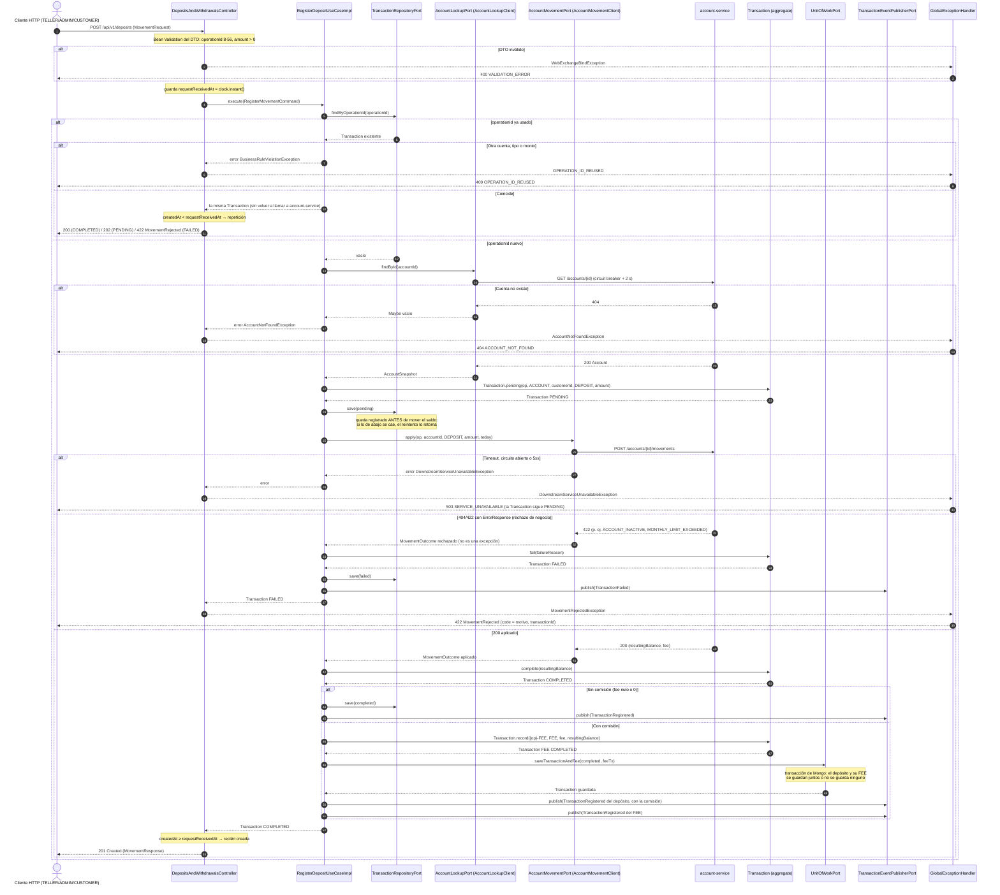

# Secuencia — Depósito con comisión e idempotencia (`POST /deposits`)

Implementado en `RegisterDepositUseCaseImpl` → `AbstractRegisterMovementUseCase` (R3, compartido
con el retiro), `AccountLookupClient` / `AccountMovementClient` (R7), `MongoUnitOfWorkAdapter` (R4) y
`DepositsAndWithdrawalsController` / `GlobalExceptionHandler` (R5). El retiro (`POST /withdrawals`)
sigue exactamente el mismo flujo con `type = WITHDRAWAL`.

## Notas

- **Idempotencia en dos niveles.** Aquí, por `operationId` (índice único `uk_tx_operation_id`, con
  recuperación de carrera en `TransactionPersistenceAdapter`); y en `account-service`, que recibe la
  misma `operationId` y no vuelve a mover el saldo. Por eso es seguro que el job de recuperación
  reintente un `PENDING` (ver `recover-pending.md`).
- **200 vs 201.** Los casos de uso devuelven el aggregate sin una bandera de "nuevo"; el controller
  lo deduce comparando `createdAt` con el instante en que recibió la petición
  (`TransactionRestMapper.wasCreatedByThisRequest`).
- **Un rechazo no es un error.** `AccountMovementClient` traduce cualquier 404/422 con cuerpo
  `ErrorResponse` a un `MovementOutcome` rechazado; solo un fallo técnico (timeout, circuito
  abierto, 5xx) se vuelve `DownstreamServiceUnavailableException` y cuenta para el circuit breaker.
- **La comisión la decide la cuenta, no este servicio.** `account-service` cobra `transactionFee`
  cuando el movimiento supera las transacciones libres del mes (también en depósitos) y la devuelve
  en `fee`; aquí solo se registra como `FEE` con `operationId` `{op}-FEE` (regla 11).
- **Pendiente conocido:** `MovementResponse.feeTransaction` no se completa (el puerto solo devuelve
  el movimiento padre) y la `Transaction` `FEE` no lleva `parentTransactionId`; se relaciona con el
  padre por el sufijo `-FEE` de su `operationId`.
