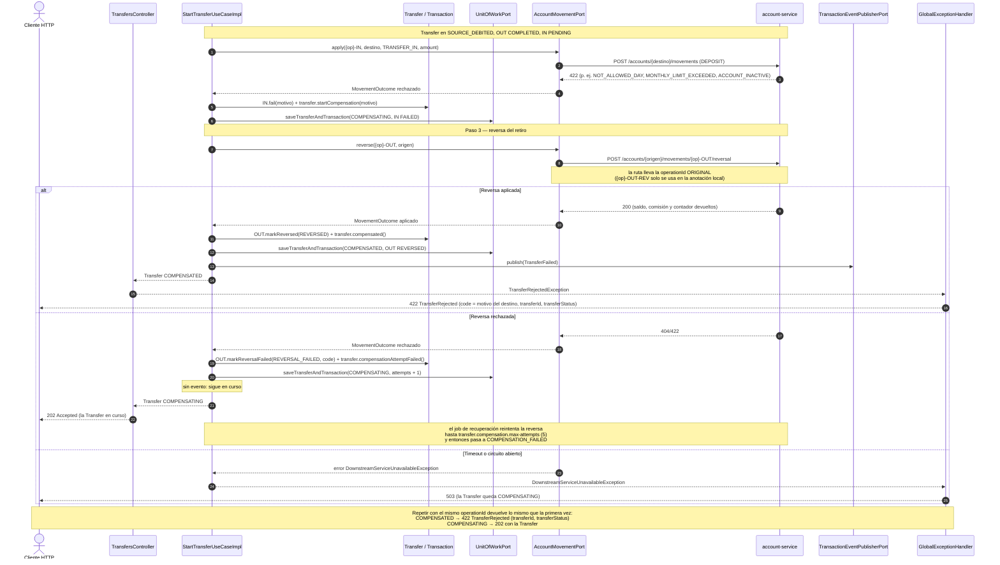

# Secuencia — Transferencia con compensación (`POST /transfers`)

Mismo inicio que `transfer-success.md` hasta `SOURCE_DEBITED`. Aquí el depósito en el destino es
rechazado y la saga **revierte** el retiro del origen (regla 8). Implementado en
`StartTransferUseCaseImpl.onCreditRejected` / `reverseDebit` (R3) y en
`AccountMovementClient.reverse` (R7).

## Notas

- **La ruta de la reversa lleva la operación original.** `reverse(debitCompleted.operationId(), ...)`
  envía `{op}-OUT` en `/movements/{operationId}/reversal`, que es lo que `ReverseMovementUseCaseImpl`
  de `account-service` busca en `account_operations`. `{op}-OUT-REV` (`forReversal()`) solo se usa como
  identificador del `TransactionReversal` que se anota en la pata local. (Corregido tras R10: antes se
  enviaba `{op}-OUT-REV` y contra el servicio real cada intento daba 404 → `COMPENSATION_FAILED`.)

- **La reversa es idempotente**: `account-service` identifica la reversa por la `operationId` de la
  pata original (`{op}-OUT`) y no la aplica dos veces; por eso el reintento es seguro. Devuelve el
  saldo, la comisión que hubiera cobrado y el contador de movimientos del mes, aunque la cuenta ya
  esté `INACTIVE`.
- **La comisión del retiro también se revierte.** Si la cuenta cobró comisión por la pata de salida, `{op}-OUT-FEE` pasa a `REVERSED` junto con la pata y la `Transfer` (`TransferLegs.saveCompensated`, una sola transacción de Mongo): la cuenta devolvió monto y comisión.
- **La pata de salida no se borra**: queda `REVERSED` con su `reversal` anotado; el historial del
  origen muestra el retiro y su reversa (regla 13, historial inmutable).
- **Retiro rechazado (paso 1).** Si el que falla es el retiro, no hay nada que compensar: la
  `Transfer` pasa de `STARTED` a `FAILED`, la pata `OUT` a `FAILED`, se publica `TransferFailed` y
  se responde 422 `TransferRejected` con el motivo del origen (p. ej. `INSUFFICIENT_FUNDS`).
- **Misma respuesta la primera vez y al repetir.** El caso de uso nunca convierte un rechazo en
  excepción: devuelve la `Transfer` y `TransfersController` decide por su estado (`FAILED` /
  `COMPENSATED` → 422 `TransferRejected` con `transferId` y `transferStatus`; `COMPENSATING` → 202).
  Es el mismo camino que la repetición del `operationId`. (Corregido en P2, paso 2.5: antes la primera
  petición respondía un `ErrorResponse` simple y un intento de reversa fallido daba 422 en vez de 202.)
