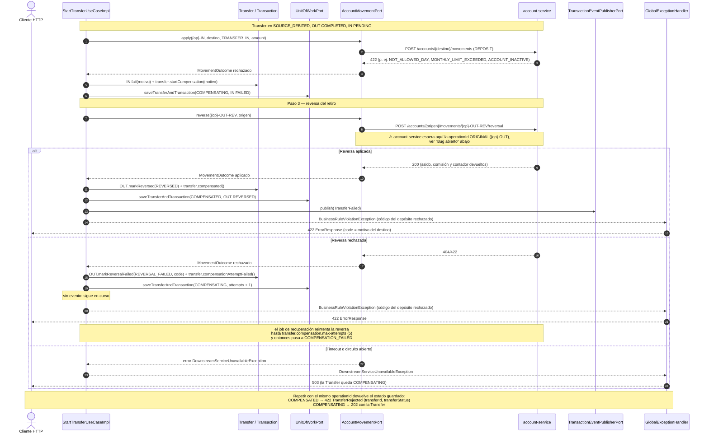

# Secuencia — Transferencia con compensación (`POST /transfers`)

Mismo inicio que `transfer-success.md` hasta `SOURCE_DEBITED`. Aquí el depósito en el destino es
rechazado y la saga **revierte** el retiro del origen (regla 8). Implementado en
`StartTransferUseCaseImpl.onCreditRejected` / `reverseDebit` (R3) y en
`AccountMovementClient.reverse` (R7).

## Notas

- **⚠ Bug abierto — la reversa nunca encuentra la operación.** `StartTransferUseCaseImpl.reverseDebit`
  y `RecoverPendingOperationsUseCaseImpl.retryReversal` llaman a
  `reverse(debitCompleted.operationId().forReversal(), ...)`, y `AccountMovementClient` pone ese valor
  en la ruta: `/movements/{op}-OUT-REV/reversal`. Pero el contrato de `account-service` dice que ese
  segmento es la `operationId` de la operación **original** (`{op}-OUT`), y
  `ReverseMovementUseCaseImpl` la busca en `account_operations`. Resultado contra el servicio real:
  404 `OPERATION_NOT_FOUND` en cada intento → `REVERSAL_FAILED` → a los 5 intentos
  `COMPENSATION_FAILED`, con el dinero fuera del origen. Las pruebas no lo ven porque
  `TestAdapters` acepta cualquier `operationId` y `AccountMovementClientTest` llama al cliente
  directamente con `op-1`. Corrección: pasar `debitCompleted.operationId()` a `reverse(...)` en los
  dos casos de uso y dejar `forReversal()` solo para el `TransactionReversal` que se anota.

- **La reversa es idempotente**: `account-service` identifica la reversa por la `operationId` de la
  pata original (`{op}-OUT`) y no la aplica dos veces; por eso el reintento es seguro. Devuelve el
  saldo, la comisión que hubiera cobrado y el contador de movimientos del mes, aunque la cuenta ya
  esté `INACTIVE`.
- **La pata de salida no se borra**: queda `REVERSED` con su `reversal` anotado; el historial del
  origen muestra el retiro y su reversa (regla 13, historial inmutable).
- **Retiro rechazado (paso 1).** Si el que falla es el retiro, no hay nada que compensar: la
  `Transfer` pasa de `STARTED` a `FAILED`, la pata `OUT` a `FAILED`, se publica `TransferFailed` y
  se responde 422 con el motivo del origen (p. ej. `INSUFFICIENT_FUNDS`).
- **Diferencia con el contrato (pendiente).** En la primera petición un rechazo se propaga como
  `BusinessRuleViolationException` y el cuerpo es un `ErrorResponse` simple, sin `transferId` ni
  `transferStatus`; solo la repetición pasa por `TransferRejectedException` y devuelve el cuerpo
  `TransferRejected` completo. Del mismo modo, un intento de reversa fallido responde 422 aunque la
  `Transfer` siga `COMPENSATING` (el contrato pide 202 en ese estado). Las pruebas de
  `TransfersControllerTest` simulan el caso de uso devolviendo la `Transfer` ya rechazada, por eso
  no lo detectan.
