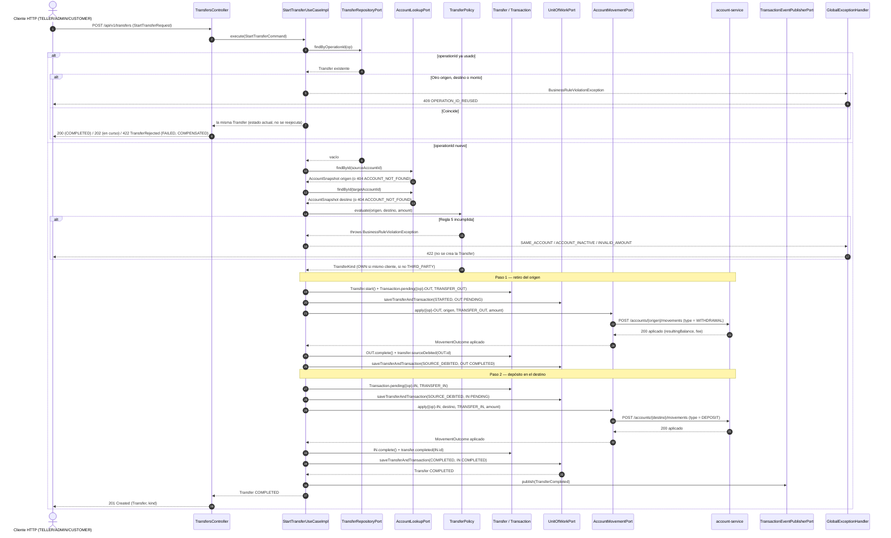

# Secuencia — Transferencia exitosa (`POST /transfers`)

Saga **orquestada** por `StartTransferUseCaseImpl` (R3): retira del origen (`{op}-OUT`) y deposita
en el destino (`{op}-IN`), guardando cada paso junto con el estado de la `Transfer` en una
transacción de Mongo (`UnitOfWorkPort.saveTransferAndTransaction`, R4). Controller:
`TransfersController` (R5). El camino con rechazo y reversa está en `transfer-compensation.md`.

## Notas

- **Cada paso se persiste antes de llamar a `account-service`.** Si el proceso cae a mitad de la
  saga, la `Transfer` queda en `STARTED` o `SOURCE_DEBITED` y la retoma el job de recuperación con
  las mismas `operationId` de cada pata, que `account-service` reconoce como repetidas.
- **Cada cuenta aplica sus propias reglas y comisiones** a su pata (regla 10): el retiro puede
  cobrar comisión en el origen y el depósito en el destino. `TRANSFER_OUT`/`TRANSFER_IN` se envían a
  `account-service` como `WITHDRAWAL`/`DEPOSIT`, los únicos tipos que entiende.
- **La comisión de cada pata queda en el historial**: si la cuenta cobró, la pata se guarda junto con
  su `FEE` (`{op}-OUT-FEE` / `{op}-IN-FEE`, enlazada por `parentTransactionId`) en la misma transacción
  de Mongo que la `Transfer` (`TransferLegs.saveApplied`). Así el historial (y los reportes) explican
  el saldo.
- **Fallo técnico a mitad de camino** (timeout, circuito abierto): la petición responde 503 y la
  `Transfer` queda en el último estado guardado; no se pierde ni se duplica dinero.
- **P3:** las dos llamadas REST a `account-service` se reemplazan por los comandos
  `transaction.movement.requested` (tópico `account.command`) y sus respuestas
  `account.movement.applied/rejected`, sin tocar `Transfer`.
