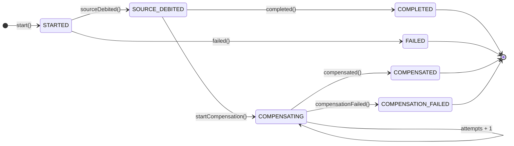
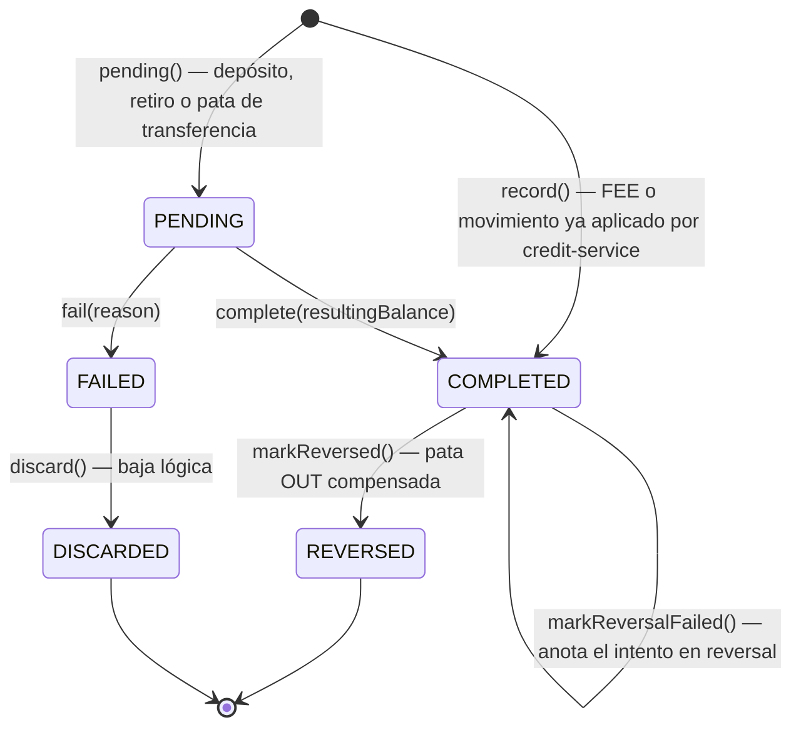

# UML de dominio — `transaction-service`

Dos aggregates (Java records, inmutables): `Transaction` (un movimiento del historial de cualquier
producto) y `Transfer` (la saga de una transferencia entre cuentas). Todo en `domain/model` y
`domain/service`, sin dependencias de Spring — mismo criterio que `customer-service` y
`account-service`. El saldo **no** vive aquí: lo aplica `account-service`; este servicio solo guarda
el resultado (`resultingBalance`).

```mermaid
classDiagram
    class Transaction {
        <<aggregate root, record>>
        +TransactionId id
        +OperationId operationId
        +ProductRef product
        +String customerId
        +TransactionType type
        +Money amount
        +Money resultingBalance
        +TransactionStatus status
        +FailureReason failureReason
        +TransferId transferId
        +TransactionId parentTransactionId
        +String payerCustomerId
        +String description
        +TransactionReversal reversal
        +Instant occurredAt
        +Instant createdAt
        +Instant updatedAt
        +pending(operationId, product, customerId, type, amount, ..., clock)$ Transaction
        +record(operationId, product, customerId, type, amount, resultingBalance, description, clock)$ Transaction
        +complete(resultingBalance, clock) Transaction
        +fail(reason, clock) Transaction
        +markReversed(reversal, clock) Transaction
        +markReversalFailed(reversal, clock) Transaction
        +updateDescription(newDescription, clock) Transaction
        +discard(clock) Transaction
        +matches(product, type, amount) bool
    }

    class Transfer {
        <<aggregate root, record>>
        +TransferId id
        +OperationId operationId
        +String sourceAccountId
        +String targetAccountId
        +Money amount
        +TransferKind kind
        +TransferStatus status
        +FailureReason failureReason
        +TransactionId debitTransactionId
        +TransactionId creditTransactionId
        +int compensationAttempts
        +String description
        +String sourceCustomerId
        +String targetCustomerId
        +String requestedBy
        +long version
        +Instant createdAt
        +Instant updatedAt
        +start(operationId, source, target, amount, kind, ..., clock)$ Transfer
        +sourceDebited(debitTransactionId, clock) Transfer
        +completed(creditTransactionId, clock) Transfer
        +failed(reason, clock) Transfer
        +startCompensation(reason, clock) Transfer
        +compensationAttemptFailed(clock) Transfer
        +compensated(clock) Transfer
        +compensationFailed(clock) Transfer
        +matches(source, target, amount) bool
    }

    class TransferPolicy {
        <<domain service>>
        +evaluate(source, target, amount)$ TransferKind
    }

    class AccountSnapshot {
        <<value object, record>>
        +String accountId
        +String customerId
        +AccountType type
        +AccountStatus status
    }

    class OperationId {
        <<value object, record>>
        +String value
        +forTransferOut() OperationId
        +forTransferIn() OperationId
        +forReversal() OperationId
        +forFee() OperationId
    }

    class ProductRef {
        <<value object, record>>
        +String productId
        +ProductType productType
    }

    class Money {
        <<value object, record>>
        +BigDecimal amount
        +String currency
        +plus(Money) Money
        +minus(Money) Money
        +isGreaterThanOrEqualTo(Money) bool
        +isZero() bool
    }

    class FailureReason {
        <<value object, record>>
        +String code
        +String message
    }

    class TransactionReversal {
        <<value object, record>>
        +OperationId operationId
        +ReversalOutcome outcome
        +String reasonCode
    }

    class MovementOutcome {
        <<value object, record>>
        +OperationId operationId
        +boolean applied
        +Money resultingBalance
        +Money fee
        +FailureReason failureReason
        +applied(operationId, resultingBalance, fee)$ MovementOutcome
        +rejected(operationId, failureReason)$ MovementOutcome
    }

    class DateRange {
        <<value object, record>>
        +Instant from
        +Instant to
    }

    class TransactionId {
        <<value object, record>>
        +String value
        +newId()$ TransactionId
    }

    class TransferId {
        <<value object, record>>
        +String value
        +newId()$ TransferId
    }

    class TransactionType {
        <<enumeration>>
        DEPOSIT
        WITHDRAWAL
        TRANSFER_OUT
        TRANSFER_IN
        FEE
        CREDIT_PAYMENT
        CARD_PAYMENT
        CARD_CHARGE
        DEBIT_PAYMENT
        YANKI_PAYMENT_OUT
        YANKI_PAYMENT_IN
    }

    class TransactionStatus {
        <<enumeration>>
        PENDING
        COMPLETED
        FAILED
        REVERSED
        DISCARDED
    }

    class TransferStatus {
        <<enumeration>>
        STARTED
        SOURCE_DEBITED
        COMPLETED
        FAILED
        COMPENSATING
        COMPENSATED
        COMPENSATION_FAILED
    }

    class TransferKind {
        <<enumeration>>
        OWN
        THIRD_PARTY
    }

    class ProductType {
        <<enumeration>>
        ACCOUNT
        CREDIT
        CREDIT_CARD
    }

    class ReversalOutcome {
        <<enumeration>>
        REVERSED
        REVERSAL_FAILED
    }

    class AccountType {
        <<enumeration>>
        SAVINGS
        CHECKING
        FIXED_TERM
    }

    class AccountStatus {
        <<enumeration>>
        ACTIVE
        INACTIVE
    }

    Transaction "1" *-- "1" TransactionId
    Transaction "1" *-- "1" OperationId
    Transaction "1" *-- "1" ProductRef
    Transaction "1" *-- "1..2" Money : amount, resultingBalance
    Transaction "1" *-- "0..1" FailureReason
    Transaction "1" *-- "0..1" TransactionReversal : intento de reversa
    Transaction --> TransactionType
    Transaction --> TransactionStatus
    Transaction ..> TransferId : pata de una transferencia
    Transaction ..> TransactionId : parentTransactionId

    Transfer "1" *-- "1" TransferId
    Transfer "1" *-- "1" OperationId
    Transfer "1" *-- "1" Money : amount
    Transfer "1" *-- "0..1" FailureReason
    Transfer --> TransferKind
    Transfer --> TransferStatus
    Transfer ..> TransactionId : debitTransactionId, creditTransactionId

    ProductRef --> ProductType
    TransactionReversal *-- OperationId
    TransactionReversal --> ReversalOutcome
    MovementOutcome *-- OperationId
    MovementOutcome o-- "0..2" Money : resultingBalance, fee
    MovementOutcome o-- "0..1" FailureReason

    TransferPolicy ..> AccountSnapshot : origen y destino
    TransferPolicy ..> TransferKind : devuelve
    AccountSnapshot --> AccountType
    AccountSnapshot --> AccountStatus
```

`AccountSnapshot` y `MovementOutcome` no se persisten: son la vista que devuelven los puertos hacia
`account-service` (`AccountLookupPort` y `AccountMovementPort`). `DateRange` solo se usa en los
filtros del historial.

## Estados de `Transfer` (saga orquestada)

| Transición | Cuándo |
|---|---|
| `start()` | Se crea junto con la pata `{op}-OUT` en `PENDING` |
| `sourceDebited()` | `account-service` aplicó el retiro del origen |
| `failed()` | El retiro fue rechazado: no se movió dinero |
| `completed()` | El depósito en el destino fue aplicado |
| `startCompensation()` | El depósito fue rechazado: hay que devolver el retiro |
| `compensationAttemptFailed()` (attempts + 1) | Un intento de reversa fue rechazado; sigue `COMPENSATING` |
| `compensated()` | La reversa fue aplicada: el dinero volvió al origen |
| `compensationFailed()` | Se agotaron los intentos (`attempts ≥ max`) |

- `STARTED`, `SOURCE_DEBITED` y `COMPENSATING` son estados **en curso**: los retoma
  `RecoverPendingOperationsUseCaseImpl` (ver `docs/sequence/recover-pending.md`).
- `COMPENSATION_FAILED` es el único estado que exige intervención humana: el dinero salió del origen
  y no se pudo devolver tras `transfer.compensation.max-attempts` intentos (5 por defecto).
- Cualquier transición desde un estado distinto del esperado lanza `InvalidTransitionException`.

## Estados de `Transaction`

`updateDescription()` no cambia el estado y se permite en cualquiera salvo `DISCARDED`.

## Invariantes que vive el dominio (no el mapper ni el controller)

| # | Regla | Dónde se aplica |
|---|---|---|
| 1 | Monto > 0 (`INVALID_AMOUNT`); `Money` nunca negativo, escala 2, solo PEN | `Transaction.pending/record`, `TransferPolicy`, `Money` |
| 3 | Un movimiento nace `PENDING` y pasa a `COMPLETED` o `FAILED`; el motivo del rechazo se conserva | `Transaction.complete/fail` |
| 5 | Transferencia: origen ≠ destino (`SAME_ACCOUNT`), ambas cuentas `ACTIVE` (`ACCOUNT_INACTIVE`), monto > 0 | `TransferPolicy.evaluate` |
| 6 | `OWN` si ambas cuentas son del mismo cliente; si no, `THIRD_PARTY` | `TransferPolicy.evaluate` |
| 8-9 | Saga: retiro → depósito → reversa si el depósito falla; reintentos contados hasta `COMPENSATION_FAILED` | `Transfer` (transiciones de arriba) |
| 12 | El tipo debe corresponder al producto (`INVALID_TYPE_FOR_PRODUCT`): `CREDIT` → `CREDIT_PAYMENT`; `CREDIT_CARD` → `CARD_PAYMENT`/`CARD_CHARGE` | `Transaction.pending/record` |
| 13 | Historial inmutable: solo se edita `description` (máx. 140, no en `DISCARDED` → `TRANSACTION_DISCARDED`); solo se descarta un `FAILED` (`NOT_DISCARDABLE`) | `Transaction.updateDescription/discard` |
| 15 | `from` ≤ `to` en las consultas | `DateRange` |
| 17 | Las `operationId` de las patas se derivan: `{op}-OUT`, `{op}-IN`, `{op}-FEE`; la reversa de una pata, `{pata}-REV` | `OperationId.forTransferOut/In/Fee/Reversal` |

Las reglas 2 (idempotencia), 10 y 11 (comisiones de cada cuenta, guardadas como `FEE`) y 14
(reintento de pendientes) **no** viven en los aggregates: dependen del repositorio o de
`account-service`, así que se resuelven en los casos de uso — ver los diagramas de
`docs/sequence/`. Las reglas 4, 7 y 16 (alcance de `CUSTOMER`) dependen de la seguridad, que en
P1/P2 está desactivada (`security.enabled: false`); quedan para P3.
